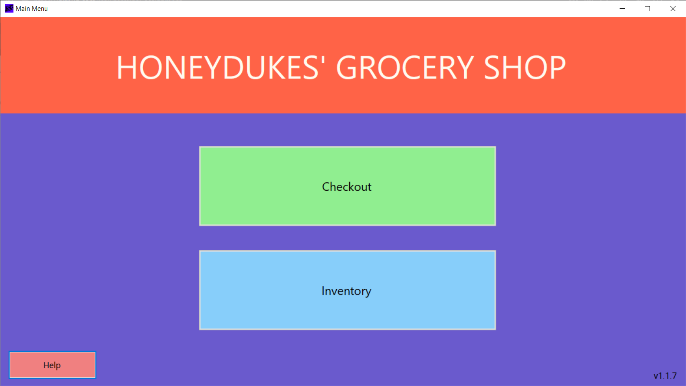
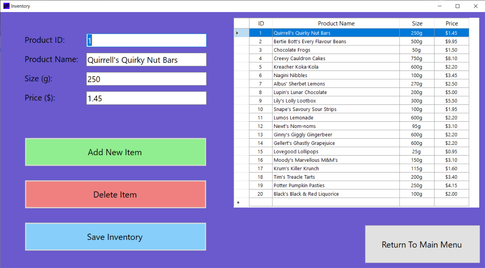
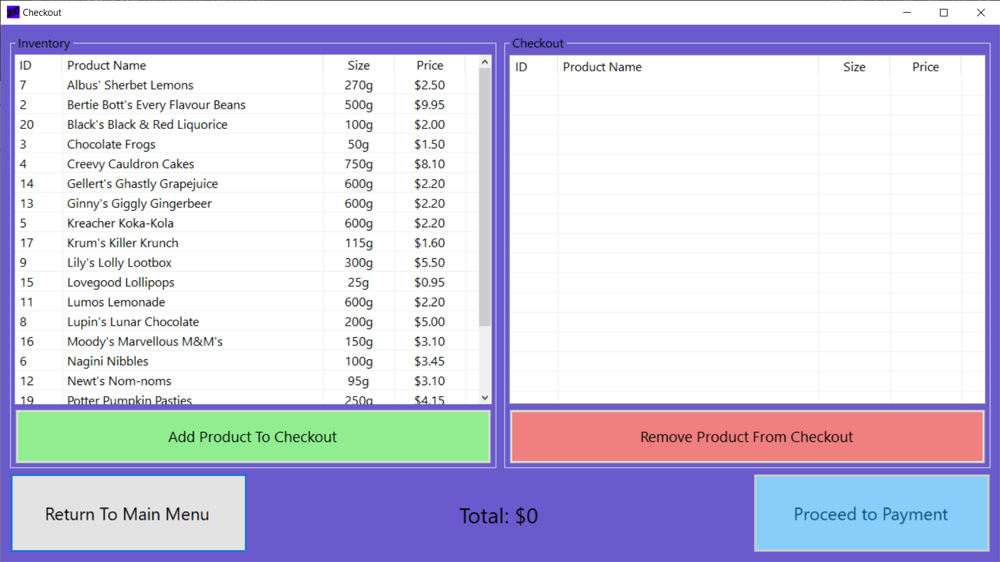
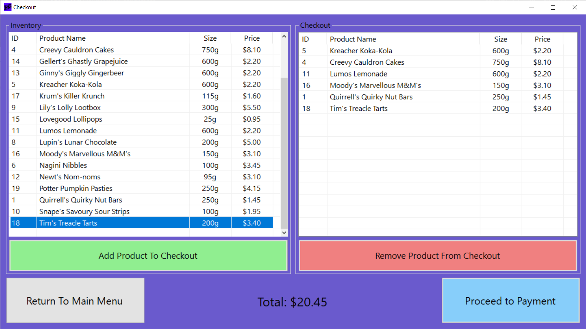
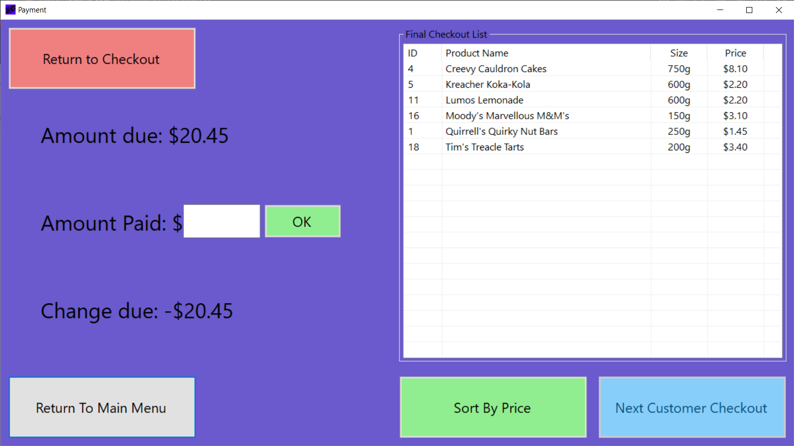

# Inventory [and] Sales System

Extract from [the manual](ISS_Manual.pdf):

*The Inventory & Sales System (or ISS for short) is an application designed to allow shopkeepers like you to keep an inventory of their products (using a Microsoft Access database) and allow customers to checkout items.
For this system to function, you’ll need a Windows computer with Microsoft Access installed. As for hardware, machines spanning the past decade should run the application fine. Additionally, screen resolution of at least 1366x768 will be comfortable for use of the program.
Enjoy shopkeeping made easy!*

This project was originally created in 2017 using Visual Basic as part of an assignment - to summarise, it achieves the following functionality:
* Add/edit/delete items and their properties
* Add/remove products to a customer's checkout
* Display items in alphabetical order on the Checkout screen
* Button that sorts customer's purchased items in descending order by item price

This instance of the ISS was tailored to a fictional store called Honeydukes' Grocery Shop.

## Screen Captures

### Main Menu

### Inventory

### Checkout

